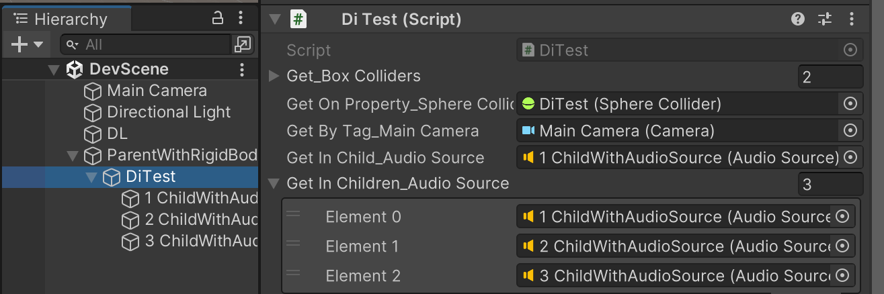

# Dependency Injection
Simplified dependency Injection for Unity utilizing SourceGeneration making it as performant as possible.

## Installation
You can choose manually installing the package or from GitHub source.

### Add package from git URL
Use the Package Manager's ```+/Add package from git URL``` function.
The URL you should use is this:
```
https://github.com/LurkingNinja/com.lurking-ninja.dependency.git?path=Packages/com.lurking-ninja.dependency
```

### Manual install
1. Download the latest ```.zip``` package from the [Release](https://github.com/LurkingNinja/com.lurking-ninja.dependency/releases) section.
2. Unpack the ```.zip``` file into your project's ```Packages``` folder.
3. Open your project and check if it is imported properly.

## Usage
```csharp
using LurkingNinja.Attributes;
using UnityEngine;

namespace DoTest
{
    [GenerateOnValidate]
    public partial class DiTest : MonoBehaviour
    {
        [Get][SerializeField]
        private BoxCollider[] get_BoxColliders;
        
        [Get][field: SerializeField]
        private SphereCollider GetOnProperty_SphereCollider { get; set; }
        
        [FindWithTag("MainCamera")][SerializeField]
        private Camera getByTag_MainCamera;
        
        [GetInChildren][IncludeInactive][SerializeField]
        private AudioSource getInChild_AudioSource;
        
        [GetInChildren][IncludeInactive][IgnoreSelf][SerializeField]
        private AudioSource[] getInChildren_AudioSource;
    }
}
```
And this code results in this inspector:

<br><br>

## API
The system is based on attributes. You decorate your fields and properties with the following attributes and the source generator will generate the appropriate code to put the searched reference in it.
Most references fulfilled in editor time, utilizing the [OnValidate()](https://docs.unity3d.com/ScriptReference/MonoBehaviour.OnValidate.html) editor-only method, but you can opt for runtime injection too (see [InjectInRuntime](#InjectInRuntime) attribute below).
If you do not use the runtime mode, this entire DI system is working through statically serialized references in Unity.

### Basics
Example:
```csharp
[Get][SerializeField]
private BoxCollider getBoxCollider;

[Get][field:SerializeField]
private BoxCollider[] getBoxCollider { get; set; };
```
You can use both fields or properties. When I say ```field``` moving forward I always mean both fields and properties.
If you want to use the editor-time injection, you need make sure your fields and properties are serializeable in Unity. In these examples I always use ```[SerializeField]``` as it is highly recommended as opposed to leave the fields as ```public```. No need to be able to be serialized if you are opting for the run-time injection ([see below](#injectinruntime)).
The type of your field will be used to generate the query. It will only return the type you specify here. If you use array (```GameObject[]```) or ```List<T>``` (```List<BoxCollider>```) then the system tries to generate a broader query (like using ```GetComponents<T>``` call instead of ```GetComponent<T>```) whenever possible.

### Base attributes
These are generating queries in order to fill either a field or a property in your class.
It is your responsibility to provide the [SerializeField](https://docs.unity3d.com/ScriptReference/SerializeField.html) or [field:SerializeField](https://forum.unity.com/threads/c-7-3-field-serializefield-support.573988/) attribute depending on
if your field is a field or a property. It is also your responsibility to choose [InjectInRuntime](#InjectInRuntime) when your receiving field is not serializable by Unity.
It is also your responsibility currently to call ```InitializeInEditor()``` from the [OnValidate](https://docs.unity3d.com/ScriptReference/MonoBehaviour.OnValidate.html)
method and/or the ```InitializeInRuntime()``` method either from your [Awake()](https://docs.unity3d.com/ScriptReference/MonoBehaviour.Awake.html) or [Start()](https://docs.unity3d.com/ScriptReference/MonoBehaviour.Start.html) method.
You can opt-in for auto-initialization if you decorate your ```class``` with [[GenerateAwake]](#generateawake), [[GenerateOnValidate]](#generateonvalidate) or [[GenerateInitializers]](#generateinitializers).
<br>

#### Get
The most basic attribute, implements a [GetComponent\<T\>()](https://docs.unity3d.com/ScriptReference/GameObject.GetComponent.html) call and store the result in the field or property you
decorate with this attribute. It only searches on the same game object. It can be used with [[Find]](#find) or [[FindWithTag]](#findwithtag) in order to access components on the resulting set of game objects.

Available modifier attributes are: [InjectInRuntime](#InjectInRuntime) and [SkipNullCheck](#skipnullcheck).

Examples:
```csharp
// Find the first BoxCollider component on the current GameObject.
// Also known as GetComponent<BoxCollider>().
[Get][SerializeField]
private BoxCollider getBoxCollider;

// Find all BoxCollider components on the current GameObject.
// Also known as GetComponents<BoxCollider>().
[Get][SerializeField]
private BoxCollider[] getBoxColliders;

// Find all GameObjects named "TestChild" and find the first BoxCollider component on any of them.
[Find("TestChild")][Get][SerializeField]
private BoxCollider getFirstBoxColliderOnGameObjects;

// Find all GameObjects named "TestChild" and find all BoxCollider components on all of them.
[Find("TestChild")][Get][SerializeField]
private BoxCollider[] getAllBoxCollidersOnGameObjects;

// Find all GameObjects tagged with "EditorOnly" and find the first BoxCollider on any of them.
[FindWithTag("EditorOnly")][Get][SerializeField]
private BoxCollider getFirstBoxColliderOnAnyTaggedGameObject;

// Find all GameObjects tagged with "EditorOnly" and find all BoxColliders on all of them.
[FindWithTag("EditorOnly")][Get][SerializeField]
private BoxCollider[] getAllBoxCollidersOnTaggedGameObjects;
```
<br>

#### Find
This attribute generates a [GameObject.Find(gameObjectName)](https://docs.unity3d.com/ScriptReference/GameObject.Find.html). The ```gameObjectName``` is a
```string``` parameter and should be passed in the ```Find``` attribute.
This will look for any game objects with the specified name. If you use it with [[Get]](#get), you can address the first or all game object in the set which has the correct ```Component``` on it.

Available modifier attributes are: [InjectInRuntime](#injectinruntime) and [SkipNullCheck](#skipnullcheck).

Examples:
```csharp
// Find the first GameObject with the name "TestChild", but ignore the current GameObject.
[Find("TestChild")][IgnoreSelf][SerializeField]
private GameObject findDirectionalLight;

// Find all GameObjects with the name "TestChild", including the current one.
// Results in an array.
[Find("TestChild")][SerializeField]
private GameObject[] findArrayByName;

// Find all GameObjects with the name "TestChild", including the current one and the inactive ones.
// Results in a List<GameObject>.
[Find("TestChild")][IncludeInactive][SerializeField]
private List<GameObject> findListByName;

// Find all GameObjects with the name "TestChild" and return the first BoxCollider component from any of them.
[Find("TestChild")][Get][SerializeField]
private BoxCollider findFirstBoxColliderOnManyGameObject;

// Find all GameObjects with the name "TestChild" and return all the BoxCollider components from all of them.
[Find("TestChild")][Get][SerializeField]
private BoxCollider[] findManyBoxColliderOnManyGameObject;
```
<br>

#### FindWithTag
Generates a [GameObject.FindWithTag(tagName)](https://docs.unity3d.com/ScriptReference/GameObject.FindWithTag.html). The ```tagName``` should be passed in to the ```FindWithTag``` attribute.

Available modifier attributes are: [InjectInRuntime](#injectinruntime) and [SkipNullCheck](#skipnullcheck).

Examples:
```csharp
// Find all GameObjects tagged with "MainCamera" and return with the first one.
// Also known as GameObject.FindWithTag() call.
[FindWithTag("MainCamera")][SerializeField]
private GameObject theCameraGameObject;

// Find all GameObjects tagged with "EditorOnly" tag.
[FindWithTag("EditorOnly")][SerializeField]
private GameObject[] nonPlayModeGameObjects;

// Find all GameObjects tagged with "Player" and return with the first MeshRenderer on any of them.
[FindWithTag("Player")][Get][SerializeField]
private MeshRenderer playerRenderer;

// Find all GameObjects tagged with "Obstacles" and return with all the BoxColliders on all of them.
[FindWithTag("Obstacles")][Get][SerializeField]
private BoxCollider[] allObstacleColliders;
```
<br>

#### GetInChildren
Utilizes a [GetComponentInChildren\<T\>(includeInactive)](https://docs.unity3d.com/ScriptReference/Component.GetComponentInChildren.html).
If it is called on [arrays](https://learn.microsoft.com/en-us/dotnet/csharp/language-reference/builtin-types/arrays), or [List<T>](https://learn.microsoft.com/en-us/dotnet/api/system.collections.generic.list-1?view=netstandard-2.1) it generates [GameObject.GetComponentsInChildren\<T\>](https://docs.unity3d.com/ScriptReference/Component.GetComponentsInChildren.html).

Available modifier attributes are: [IncludeInactive](#includeinactive), [InjectInRuntime](#injectinruntime) and [SkipNullCheck](#skipnullcheck).

Examples:
```csharp
// Find the first Rigidbody component on this game object or any children.
[GetInChildren][SerializeField]
private Rigidbody rigidBodyInChildren;

// Find the first Rigidbody component on any of the children but excluding the current GameObject.
[GetInChildren][IgnoreSelf][SerializeField]
private Rigidbody rigidBodyOnlyInChildren;

// Find all Rigidbody components on all of the children game objects and on the current one as well.
[GetInChildren][SerializeField]
private Rigidbody[] findRigidBodiesInChildren;
```
<br>

#### GetInParent
It generates a [GetComponentInParent\<T\>()](https://docs.unity3d.com/ScriptReference/GameObject.GetComponentInParent.html) call.
If it is called on [arrays](https://learn.microsoft.com/en-us/dotnet/csharp/language-reference/builtin-types/arrays), or [List<T>](https://learn.microsoft.com/en-us/dotnet/api/system.collections.generic.list-1?view=netstandard-2.1) it generates [GameObject.GetComponentsInChildren\<T\>](https://docs.unity3d.com/ScriptReference/Component.GetComponentsInChildren.html).

Available modifier attributes are: [IncludeInactive](#includeinactive), [InjectInRuntime](#injectinruntime) and [SkipNullCheck](#skipnullcheck).

Examples:
```csharp
// Find the first Rigidbody component on any of the parents but excluding the current GameObject.
[GetInParent][IgnoreSelf][SerializeField]
private Rigidbody firstRigidbodyOnParents;

// Find all Rigidbody components on all of the parent game objects and on the current one as well.
[GetInParent][SerializeField]
private Rigidbody[] findRigidBodiesOnParents;
```
<br>

### Modifier attributes
These have no effect alone but modifying the behavior of the base attributes or the generation process.

#### GenerateAwake
If you decorate your ```partial class``` with the ```GenerateAwake```  attribute, the system will automatically generate a 
```csharp
private void Awake() => InitializeInRuntime();
```
method with this call in order to automatically resolve runtime dependencies. Recommended if you do not use the ```Awake``` method yourself, if you do, place the ```InitializeInRuntime();``` inside your own method.  

#### GenerateInitializers
If you decorate your ```partial class``` with the ```GenerateInitializers```  attribute, the system will automatically generate both an [Awake](#generateawake) and a [OnValidate](#generateonvalidate) call. See details in their respective section.
<br><br>

#### GenerateOnValidate
If you decorate your ```partial class``` with the ```GenerateOnValidate```  attribute, the system will automatically generate a 
```csharp
private void OnValidate() => InitializeInEditor();
```
method with this call in order to automatically resolve editor time dependencies. Recommended if you do not use the ```OnValidate``` method yourself, if you do, place the ```InitializeInEditor();``` inside your own method.
<br><br>

#### IgnoreSelf
When  it is allowed to use, it filters out the current game object from the results.
Allowed to use in conjunction with: [Find](#find), [GetInChildren](#getinchildren), [GetInParent](#getinparent). 
<br>

#### IncludeInactive
When it is permitted to use, the search will include inactive components or game objects as well.
Allowed to use in conjunction with: [Find](#find), [GetInChildren](#getinchildren), [GetInParent](#getinparent).
<br>

#### InjectInEditor
It causes to put the generation into the ```InjectInEditor()``` instead of the ```InjectInRuntime()``` method allowing you
to call it in the Editor (from ```OnValidate``` for example).
<br>

#### InjectInRuntime
It causes to put the generation into the ```InjectInRuntime()``` instead of the ```InjectInEditor()``` method allowing you
to call it during play-mode or in build.
<br>

#### SkipNullCheck
If this attribute is added to a field or property, there won't be a null-check performed when a value is added  causing
overwrite no matter if another value is already attached or not.
<br>

#### StableSort
This attribute only usable with [Find](#find) and causing the found game objects sorted by [InstanceId](https://docs.unity3d.com/ScriptReference/FindObjectsSortMode.InstanceID.html) before return with the result.

### TODO
- Reintroduce asset referencing (GetInAssets)
- Develop filtering
- Add C# class (```[Depends]``` - ```[Provides]```) dependency injection